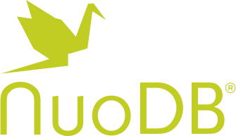

 

# NuoDB Helm Charts

[](https://circleci.com/gh/nuodb/nuodb-helm-charts/tree/master)

This repository includes Helm Charts that can be used to deploy NuoDB in Kubernetes. You may also contribute by submitting enhancement requests if you like. Charts are curated application definitions for Helm. For more information about installing and using Helm, see its
[README.md](https://github.com/helm/helm/tree/master/README.md). To get a quick introduction to Helm Charts see this [chart document](https://github.com/helm/helm/blob/master/docs/charts.md). For more information on using Helm, refer to the [Helm's documentation](https://github.com/kubernetes/helm#docs).

## NuoDB Helm Chart Version support

For a list of supported NuoDB Helm Chart releases and where to download, click the `Releases` tab above. 
To enable automated notification of new releases, click the `Watch` button above and subscribe to the `Releases Only` selection.


## Software Release requirements

| Software   | Release Requirements                           | 
|------------|------------------------------------------------|
| Kubernetes |  The latest and previous minor versions of Kubernetes. For example, if the latest minor release of Kubernetes is 1.16 then 1.16 and 1.15 are offically supported. Charts may still work on previous versions of Kubernertes even though they are outside the target support window. To provide that support the API versions of objects should be those that work for both the latest minor release and the previous one.|
| Managed Kubernetes Distributions |  OpenShift 4.x, Google GKE, Amazon EKS, Azure AKS, or Rancher RKE. Charts may also work on other Kubernetes distributions. The distributions listed here are tested regularly. |
| Helm       |  Version 2 and 3 are supported, v2.9 or greater. v3.2 is the main development environment   |
| NuoDB      |  Version [4.0.4](https://hub.docker.com/r/nuodb/nuodb-ce/tags) and onwards. |

## NuoDB Helm Chart Installation

The default repository for NuoDB is located at https://storage.googleapis.com/nuodb-charts and must be enabled.

To add the charts to your local client, run the `helm repo add` command below:

```
helm repo add nuodb https://storage.googleapis.com/nuodb-charts
"nuodb" has been added to your repositories
```

To list the NuoDB charts added to your repository, run `helm search repo nuodb/`


## NuoDB Helm Chart Incubator Repository Installation

The Incubator repository contains enhancements not yet available in the supported releases. To add the Incubator charts for your local client, run the `helm repo add` command below:

```
helm repo add nuodb-incubator https://nuodb-charts-incubator.storage.googleapis.com/
"nuodb-incubator" has been added to your repositories
```

To list the NuoDB incubator charts added to your repository, run `helm search repo nuodb-incubator/`


## Install NuoDB

This GitHub repository contains the source for the packaged and versioned charts released in the [`gs://nuodb-charts` Google Storage bucket](https://console.cloud.google.com/storage/browser/nuodb-charts/) (the Chart Repository).

Follow the instructions in the [stable](stable/README.md) folder to install NuoDB: 

The charts in the `stable` directory in the master branch of this repository are the latest packaged chart in the chart repository. The purpose of this repository is to provide a place for maintaining and contributing official chart updates and enhancements into the chart repository.

Follow the instructions in the [incubator](incubator) folder to install the YCSB database workload generator (sample application): 

The charts in the `Incubator` directory allows charts to be shared and improved on until they are ready to be moved into the stable folder.

## Status of the Project

This project is still under active development. If you experience any [issues](https://github.com/nuodb/nuodb-helm-charts/issues) please let us know, or better yet, contribute a fix or feature.
