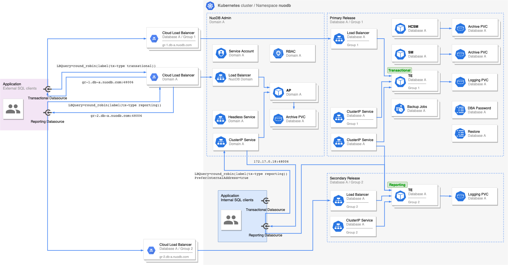

# Connect to NuoDB Database Externally

## Introduction

NuoDB supports SQL interface used by the client applications to connect to the database.
The connection protocol used by the NuoDB drivers is a two stage process.
First the driver establishes connection with the NuoDB Admin which provides the driver with a Transaction Engine (TE) connection information.
A new connection is established to the provided TE. After completing the client protocol, the connection can be used by the application to execute SQL statements.
The two stage connection process allows custom configuration of flexible and rich connection load balancing rules.
The `LBQuery` expression syntax can be used to specify the set of suitable TEs to service SQL clients and the strategy used to distribute connections to these TEs among SQL clients.
A _direct_ connection towards TEs is also supported, however, the load balancing must be done by the client application.

For more information on NuoDB client connections, check [Client Development](https://doc.nuodb.com/nuodb/latest/client-development/).

SQL clients and applications running in the same Kubernetes cluster as the NuoDB domain can connect to the database with the default NuoDB Helm Charts configuration using the NuoDB Admin `ClusterIP` service or directly using the TE `ClusterIP` service. This document focuses on external client applications running outside of the Kubernetes cluster where the NuoDB database is hosted. Allowing external access to NuoDB database is not enabled by default and requires additional configuration.

## Transaction Engine Groups

A TE group consist of TEs with the same configuration which are part of the same database most often used to serve specific SQL workload.
NuoDB Helm Charts 3.4.0+ supports deployment of one or more TE groups per database.

Multiple deployments of `database` chart for the same NuoDB database can be done in the same Kubernetes namespace where only one of them is _primary_.
One or more _secondary_ Helm releases are used to deploy additional TE groups for the same database with different configuration options.
This allows flexible configuration of each TE group including but not limited to the number of TEs in a group, their resource requirements, process labels, and scheduling rules.
SQL clients can be configured to target each TE group separately using NuoDB Admin load balancer rules.
Specifying the type of the Helm `database` release is controlled by `database.primaryRelease` option (`true` by default).

## External Access for TE Groups

External access for NuoDB database is _not_ enabled by default and is supported when using NuoDB Helm Charts 3.4.0+ and NuoDB 4.2.4+.
To enable external access to NuoDB domain and database set the `admin.externalAccess.enabled=true` and `database.te.externalAccess.enabled=true` options.

A Kubernetes service of type `LoadBalancer` or `NodePort` is created per TE group.
The Kubernetes cluster should be properly configured so that external network (Layer4) cloud load balancer is provisioned automatically.
This should allow the external SQL clients to connect to the TEs backing the service by uniquely targeting each TE group.
Most of the cloud vendors provide Kubernetes Load Balancer controllers that support different service annotation used to control the properties and configuration of the provisioned cloud load balancer.

> **NOTE**: When external access is enabled, the NuoDB Helm Charts will create internet-facing load balancers by default.
This can be changed by setting the `admin.externalAccess.internalIP=true` and `database.te.externalAccess.internalIP=true` or further customized by explicitly configuring custom annotations for the Kubernetes services using `admin.externalAccess.annotations` and `database.te.externalAccess.annotations` options.
The user provided custom annotations will overwrite the default annotations for the services.
It is a customer responsibility to correctly configure security rules and restrict access to the cloud load balancers.

Services of type `NodePort` can be created as well which won't automatically provision cloud load balancer.
For this type of deployment it is required that custom manually provisions the L4 load balancers that load balance traffic across all Kubernetes worker nodes.
Different TE groups will be reachable on different node port.

The external address and port for TEs are configured using the `external-address` and `external-port` process labels.
If supplied, they will be advertized by NuoDB Admin to the SQL clients during the second stage of the connection protocol. For more information, check [Use External Address](https://doc.nuodb.com/nuodb/latest/client-development/load-balancer-policies/#_use_external_address).

Obtaining and configuring the hostname or IP address of the L4 load balancers can be tedious and error-prone as they are provisioned asynchronously by the Kubernetes controllers.
NuoDB can inspect the Kubernetes services and configure the TE database processes with the `external-address` and `external-port` process labels when `--enable-external-access` process option is provided.
This simplifies the deployment and ensures correct configuration of the TE database processes.

> **NOTE**: If the hostname or the IP address of the provisioned cloud load balancer change over time, the TE database process needs to be restarted so that the new value is obtained.

## Examples

To demonstrate the external access using TE groups, let's consider a working example with the following requirements:

- NuoDB database is deployed in a single Kubernetes cluster.
- Online Transaction Processing (OLTP) SQL workload should be processed by TEs in _group 1_.
- Close of Business (COB) SQL workload should be processed by TEs in _group 2_.
- A set of the applications are installed in the same Kubernetes custom as NuoDB.
- Another set of the applications are installed in different Kubernetes cluster, on bare metal or in different cloud.

The resource requirements for the different TE groups may be different as there is a direct dependency to the type of SQL workload that TEs will serve.
There will be 2 _smaller_ TEs dedicated for the _OLTP_ and 1 _bigger_ TE dedicated for the _COB_ workload deployed in _nuodb_ namespace.

To satisfy the requirement having several workloads targeting different set of TEs, the `LBQuery` connection property with the correct syntax will be used.
Alternatively a load balancer policies can be configured and SQL clients can reference them using `LBPolicy` connection property.
For simplicity, `tx_type` database process label will be used to identify which workload is served by a set of TEs.
The label value is either `oltp` or `cob`.

For more advanced load balancer configuration, check [Load Balancer Policies](https://doc.nuodb.com/nuodb/latest/client-development/load-balancer-policies/).

NuoDB supports multi-tenant, multi-cluster and multi-cloud database deployments using TE groups, however, for simplicity a single-cluster single-tenant deployment will be demonstrated here.
The below diagram illustrates the deployed resources and SQL clients along with the `LBQuery` syntax.



### Deployment

The steps below will deploy NuoDB database with 2 TE groups in GKE cluster.
If you are deploying in different environment, make sure that the correct cloud provider is set in the `cloud.provider` option.
Use the `nuodb.image.tag` option to specify the NuoDB product version. 
NuoDB 4.2.4+ docker image should be used.

Install the `admin` chart and enable external access with services of type `LoadBalancer`:

```shell
helm install admin nuodb/admin \
    --namespace nuodb \
    --cloud.provider=google \
    --set admin.externalAccess.enabled=true
```

Install the `database` chart for the primary Helm release and deploying TE _group 1_:

```shell
helm install database-group1 nuodb/database \
    --namespace nuodb \
    --set cloud.provider=google \
    --set database.name=demo \
    --set database.te.externalAccess.enabled=true \
    --set database.te.otherOptions.enable-external-access=true \
    --set database.te.replicas=2 \
    --set database.te.resources.limits.cpu=4 \
    --set database.te.resources.limits.memory=8Gi \
    --set database.te.resources.requests.cpu=4 \
    --set database.te.resources.requests.memory=8Gi \
    --set database.te.labels.tx-type=oltp
```

Install the `database` chart for the secondary Helm release and deploying TE _group 2_:

```shell
helm install database-group2 nuodb/database \
    --namespace nuodb \
    --set cloud.provider=google \
    --set database.name=demo \
    --set database.primaryRelease=false \
    --set database.te.externalAccess.enabled=true \
    --set database.te.otherOptions.enable-external-access=true \
    --set database.te.replicas=1 \
    --set database.te.resources.limits.cpu=4 \
    --set database.te.resources.limits.memory=16Gi \
    --set database.te.resources.requests.cpu=4 \
    --set database.te.resources.requests.memory=16Gi \
    --set database.te.labels.tx-type=cob
```

Wait for the NuoDB database to become ready:

```shell
kubectl exec -ti admin-nuodb-cluster0-0 -- nuocmd check database \
    --db-name demo \
    --check-running \
    --num-processes 4 \
    --wait-forever
```

### Verification

Obtain the external address for the NuoDB Admin services:

```shell
DOMAIN_ADDRESS=$(kubectl get services nuodb-balancer -o jsonpath='{.status.loadBalancer.ingress[].ip}')
```

Check database processes node IDs:

```shell
kubectl exec -ti admin-nuodb-cluster0-0 -- nuocmd show database \
    --db-name demo \
    --process-format '{type} {hostname} {node_id}'
```

Use `nuosql`, found in [NuoDB Client-only Package](https://github.com/nuodb/nuodb-client), to connect to the NuoDB database from the local machine.
Repeat the command several times to ensure that the each time the expected node ID is printed.

```shell
echo 'select GETNODEID() from dual;' |  nuosql demo@${DOMAIN_ADDRESS} \
    --user dba --password secret \
    --connection-property 'LBQuery=round_robin(first(label(tx-type oltp) any))'
```

Repeat the steps for the _COB_ workload.

```shell
echo 'select GETNODEID() from dual;' |  nuosql demo@${DOMAIN_ADDRESS} \
    --user dba --password secret \
    --connection-property 'LBQuery=round_robin(first(label(tx-type cob) any))'
```

Verify that internal SQL clients can still connect to the database by setting `PreferInternalAddress=true` connection property.

```shell
kubectl exec -ti admin-nuodb-cluster0-0 -- bash -c \
    "echo 'select GETNODEID() from dual;' |  nuosql demo@nuodb-clusterip \
        --user dba --password secret \
        --connection-property 'LBQuery=round_robin(first(label(tx-type oltp) any))' \
        --connection-property 'PreferInternalAddress=true'"
```

## Cloud Provider Specifics

### Native CNI

Most of the cloud providers have support for native Kubernetes CNI plugins which allows the Pod IPs to be assigned with IPs from the VPC...

TBD

### GCP

No additional configuration is needed to enable NuoDB database external access in Google Kubernetes Engine (GKE).
For more information, check [Configuring TCP/UDP load balancing](https://cloud.google.com/kubernetes-engine/docs/how-to/service-parameters).

### AWS

To automatically provision AWS Network Load Balancer (NLB) for Kubernetes services of type `LoadBalancer`, please follow the steps in [Network load balancing on Amazon EKS](https://docs.aws.amazon.com/eks/latest/userguide/network-load-balancing.html) guide.
The [AWS Load Balancer Controller](https://docs.aws.amazon.com/eks/latest/userguide/aws-load-balancer-controller.html) should be deployed in the Amazon Elastic Kubernetes Service (EKS).
For more information on how to customize the provisioned NLB, check [Network Load Balancer](https://kubernetes-sigs.github.io/aws-load-balancer-controller/latest/guide/service/nlb/).

### Azure

No additional configuration is needed to enable NuoDB database external access in Azure Kubernetes Service (AKS).
For more information, check [Use a public Standard Load Balancer](https://docs.microsoft.com/en-us/azure/aks/load-balancer-standard).

## Troubleshooting

### Unable to connect

There may be different reasons for client connectivity problems such as:

- not _Ready_ NuoDB Admin Pods
- not _Ready_ TE pods
- incorrect external access configuration
- incorrect NuoDB Load Balancer configuration
- incorrect NLB configuration
- network connectivity problems including lack of routing, firewall configuration and many more

You can rule out any of the points above one by one.
Start by checking the database availability inside the cluster using the same connection properties as the application uses.

TBD

### TE does not start

TE started with `--enable-external-access` process option will wait for the `LoadBalancer` service IP address or hostname to be available before they start.
In case of a problem during NLB provisioning, the IP address will never be populated and the _engine_ container will fail.
The following errors can be seen the TE container logs:

```text
TBD
```

> **ACTION**: Check the evetns for the Kubernetes service of type `LoadBalancer` for this TE group using `kubectl describe service <service-name>`. Check the cloud provider documentation on how to troubleshoot the load balancer controller.

### Wrong TE is provided

TBD
