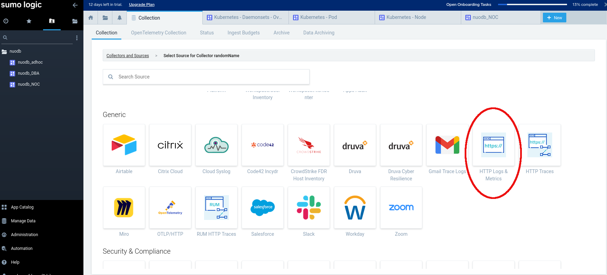
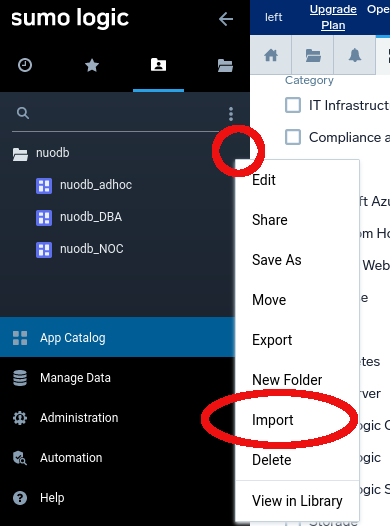

### NuoDB Insights and Sumo Logic

---

Sumo Logic is an observability suite offering end-to-end observability and security tools within one platform. Sumo Logic is an alternative monitoring solution to the current NuoDB Insights suite.

### Sumo Logic Dashboards Setup

---

1. [Sumo Logic Collectors](#sumo-logic-collectors) setup for NuoDB Insight data.

2. [NuoDB Helm Charts](#nuodb-helm-charts) modifications to enable data collection.

3. [NuoDB Insights graphs](#insights-graphs-on-sumo-logic-dashboards) install into Sumo Logic dashboards.

4. [Kubernetes Graphs](#sumo-logic-kubernetes-graphs) in Sumo Logic (Optional)

#### Sumo Logic Collectors

---

Website is https://www.sumologic.com

Create a new account or use an existing account. For a new account, skip past the introductions and go straight to the dashboard. At the time of writing, the skip link was below the introduction text.

Click on  **Manage Data**: 


Click on **Add Collector**


Select **Hosted Collector**


Add an appropriate name for the collector. This name can be anything, but will be used in the [Sumo Logic NuoDB graphs](#insights-graphs-on-sumo-logic-dashboards) to select the data collector. 

Next is to add a source to the newly created collector. At the time of writing, the source was under "Generic" and is  "HTTP logs and metrics"



Add an appropriate name for the source for the collector. This name can be anything, but will be used in the [Sumo Logic NuoDB graphs](#insights-graphs-on-sumo-logic-dashboards) to select the data source.

**Tip**: A Sumo Logic Collector may have many Data Sources. A ```Source Category``` value may be added to the Data Source meta data to help manage selection of data.

Next is to copy and keep safe the Sumo Logic metrics endpoint. This will be needed in the section for the helm database values file setup. It will be something like:

```
https://endpoint1.collection.eu.sumologic.com/receiver/v1/http/<a very very long ascii string goes here>
```


#### NuoDB Helm Charts

---

**Setup of database values yaml file**

Using the NuoDB [database](https://github.com/nuodb/nuodb-helm-charts/blob/master/stable/database/README.md) helm chart, set in values file the following values for ```nuocollector.*``` section.

Refer to [Sumo Logic Collectors](#sumo-logic-collectors) to harvest the Sumo Logic endpoint to insert into the yaml snippet below.

Set nuocollector to be enabled.

```
nuocollector:
   enabled: true
```

Set the sumologic output configuration in the plugins section.

```
  plugins:
    ## NuoDB Collector compatible plugins specific for database services
    database:
      sumologic.conf: |
        [[outputs.sumologic]]
          url = "sumologic endpoint url here"
          namepass = [ "SqlListener*", "Commits", "Inserts", "Updates", "Deletes", "WriteThrottleTime", "Pending*", "Archive*Time", "Journal*Time" ]
          fieldpass = [ "rate", "value" ]
          data_format = "carbon2"
        [[outputs.sumologic]]
          url = "sumologic endpoint url here"
          namepass = [ "Summary.*" ]
          fieldpass = [ "raw" ]
          data_format = "carbon2"
```

Example:

```
  plugins:
    ## NuoDB Collector compatible plugins specific for database services
    database:
      sumologic.conf: |
        [[outputs.sumologic]]
          url = "https://endpoint1.collection.eu.sumologic.com/receiver/v1/http/<a very very long ascii string goes here>"
          namepass = [ "SqlListener*", "Commits", "Inserts", "Updates", "Deletes", "WriteThrottleTime", "Pending*", "Archive*Time", "Journal*Time" ]
          fieldpass = [ "rate", "value" ]
          data_format = "carbon2"
        [[outputs.sumologic]]
          url = "https://endpoint1.collection.eu.sumologic.com/receiver/v1/http/<a very very long ascii string goes here>"
          namepass = [ "Summary.*" ]
          fieldpass = [ "raw" ]
          data_format = "carbon2" 
```

#### Insights graphs on Sumo Logic dashboards

---

Click on Personal -> three dots to the right of the side bar and create a new folder.


Click on the 3 dots to the right of the folder name and select Import



Upload the NuoDB dashboard JSON as a copy paste operation.  The JSON files that can be copy pasted can be found in the following locations

[docs/assets/files/Sumologic_NuoDB_AdHoc.json](assets/files/Sumologic_NuoDB_AdHoc.json)

[docs/assets/files/Sumologic_NuoDB_DBA.json](./assets/files/Sumologic_NuoDB_DBA.json)

[docs/assets/files/Sumologic_NuoDB_NOC.json](./assets/files/Sumologic_NuoDB_NOC.json)

Click "Import" at the bottom of the pane.


Set the Collector name and Source name to be the same as set in [Sumo Logic Collectors setup](#sumo-logic-collectors)


**Note:** The Sumo Logic NuoDB graphs are a subset of the graphs that are available in [Insights](https://github.com/nuodb/nuodb-insights/tree/master). Data that is sent to Sumo Logic is a subset of all the data that is sent to Insights. 

#### Sumo Logic Kubernetes Graphs

---

From the App Catalog search for classic apps "kubernetes" -> "Kubernetes" and follow the install instructions. 

The install instructions look similar to the below:

```
helm -n <sumologic namespace> upgrade --install sumologic sumologic/sumologic \
  --namespace=<sumologic namespace> \
  --create-namespace \
-f - <<EOF
sumologic:
  accessId: <access id>
  accessKey: <very long access key>
  clusterName: <Kubernetes clustername>
  collectorName: <Kubernetes collector name>
  setup:
    monitors:
      enabled: false
EOF
```

**Tip:** Use a different namespace other than the namespace for the NuoDB install. 

**Tip:** Take care to make a note of the ```accessId```, ```accessKey```, ```clusterName``` and ```collectorName```.  ```accessKey``` is shown only once.

**Caution:** Some NuoDB logs are duplicated between engine and admin. 

**Tip:** Too much logging? Control [NuoDB logs](https://doc.nuodb.com/nuodb/latest/reference-information/configuration-files/host-properties-nuoadmin.conf/) by option ```logging.consoleLogLevels``` in ```nuoadmin.conf```.

A ```nuoadmin.conf``` example snippet might be: 

```
"logging.consoleLogLevels": {
          "ROOT": "error",
          "DomainProcessStateMachine" : "info",
          "TagMessageDispatcherRegistry" : "error",
          "Server" : "error",
          "org.eclipse.jetty.server.RequestLog" : "error"
        } ,
```


