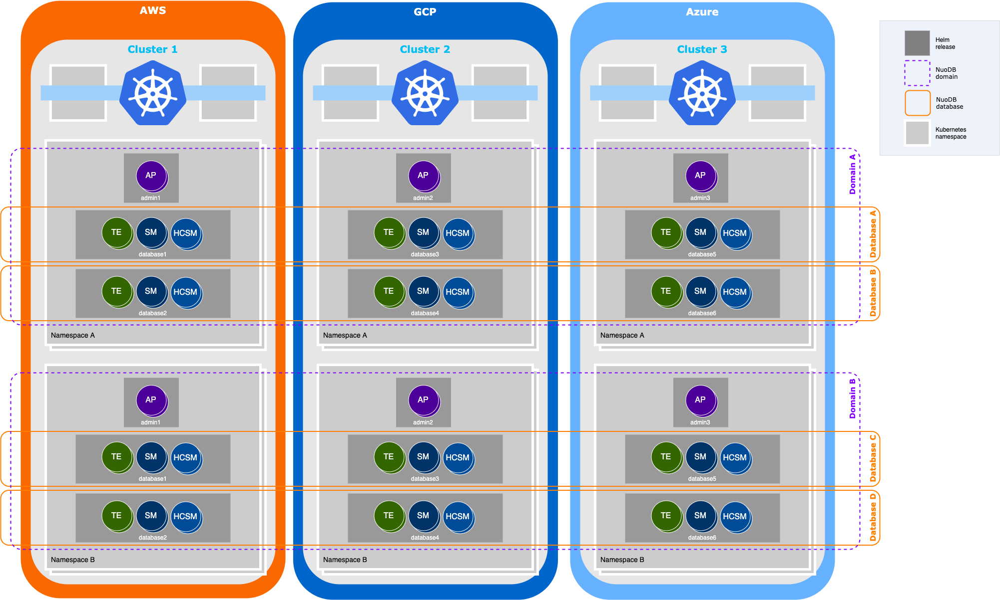

# NuoDB Rolling Upgrade in Kubernetes

## Introduction

A rolling upgrade updates a NuoDB domain, which may include multiple databases, to a new NuoDB release without shutting down the database(s).
Rolling upgrades ensure continuous database availability throughout the upgrade process.

A NuoDB domain deployed in Kubernetes using the NuoDB Helm Charts contains multiple Helm releases.
The resources are deployed by the [admin](../stable/admin) and the [database](../stable/database) Helm charts.
Depending on the database requirements, high availability configuration, and the number of target Kubernetes clusters, different types of deployment scenarios are supported:

- A domain in a single cluster with an _admin_ Helm deployment and a _database_ helm deployment
- A domain spread across multiple clusters each with an _admin_ Helm deployment and _database_ Helm deployment
- Both scenarios above could have more than one _database_ Helm deployment in the domain

The main resources installed in a single Kubernetes cluster for a single NuoDB domain and database are shown in the table below.

| NuoDB Process Type               | NuoDB Helm Chart | Kubernetes Resource Type | Scope | Purpose |
|----------------------------------|------------------|--------------------------|--------|--------|
| NuoDB Admin Process (AP)         | admin            | StatefulSet              | domain | APs in a single NuoDB domain |
| Transaction Engine (TE)          | database         | Deployment               | database | TEs in a single NuoDB database |
| Hot-copy Storage Manager (HCSM)  | database         | StatefulSet              | database | SMs with hot-copy operations enabled |
| Storage Manager (SM)             | database         | StatefulSet              | database | SMs with hot-copy operations disabled |

An example multi-cluster NuoDB deployment scenario can be seen in the diagram below.



This document focuses on upgrading NuoDB software and providing details on the upgrade mechanics specific to Kubernetes Deployments.

For more information on NuoDB database upgrade in Physical or VMware Environments, please refer to the official [NuoDB Documentation](https://doc.nuodb.com/nuodb/latest/deployment-models/physical-or-vmware-environments-with-nuodb-admin/installing-nuodb/upgrading-to-a-new-release/).
The documentation in this repository expands on the product documentation and is specific to this Helm Chart repository.

## Requirements

The Kubernetes resources described in the previous section support rolling upgrade strategy.
Any change on the Deployment or StatefulSet `.spec.template` YAML will trigger a rolling upgrade causing the controller to delete and recreate its pods.
StatefulSet controller will proceed in the same order as pod termination (from the largest ordinal to the smallest), updating each pod one at a time.
The Deployment controller will first start a new pod and wait for it to become `ready` before shutting down an old one.
For more information, refer to official Kubernetes documentation on [Rolling Upgrade Deployment](https://kubernetes.io/docs/concepts/workloads/controllers/deployment/#rolling-update-deployment) and [Rolling Upgrade StatefulSet](https://kubernetes.io/docs/concepts/workloads/controllers/statefulset/#rolling-updates).
There are some changes that do not trigger rolling upgrade and require manual restart of the Pods.
For example, updates on ConfigMaps that are used by the Pods.

Since Kubernetes will perform a rolling upgrade for every Kubernetes workload independently, three database processes can be restarted at once.
Upgrade without downtime is only possible if all databases in the domain have sufficient redundancy:

- Every database must have more than `max-lost-archives + 1` SMs, and these SMs must be part of the same StatefulSet or on different clusters.
If `--max-lost-archives` option is not configured, the default value of `0` is used.
- Every database must have more than one TE where TEs can be deployed in one or separate TE groups.
- There must be more than one AP in the domain.
To retain Raft majority during the upgrade it's recommended to configure three or more APs.

> **Note**: The `pendingReconnectTimeout` setting defines how much time the NuoDB Admin will wait for the database processes to reconnect.
In certain situations, the default timeout (60 sec.) may need to be increased to get a reliable upgrade.

The `spec.replicas` count can be configured separately for each Kubernetes workload to meet the desired redundancy requirements.
Several replica number examples for single cluster NuoDB deployment depending on the `max-lost-archives` setting are shown in the below table.

| max-lost-archives | AP | TE | HCSM | SM | Notes |
|-------------------|----|----|------|----|-------|
| 0                 | 3  | 2  | 2    | 0  |       |
| 0                 | 3  | 2  | 0    | 2  | No backups |
| 0                 | 3  | 2  | 1    | 2  |       |
| 1                 | 3  | 2  | 3    | 0  |       |
| 1                 | 3  | 2  | 0    | 3  | No backups |
| 1                 | 3  | 2  | 1    | 3  |       |
| 1                 | 3  | 2  | 2    | 2  |       |

## Preparation

Before you upgrade to a newer NuoDB release, best practices include the following steps:

- Ensure that a recent valid backup is available for every database.
For more information, refer to [NuoDB Backup and Restore in Kubernetes](./BackupAndRestore.md).
- Determine whether you will want to change any NuoDB Helm Charts options or NuoDB product configuration files to take advantage of new features or changes to features.
For more information check the [NuoDB Helm Chart Release Notes](https://github.com/nuodb/nuodb-helm-charts/releases), [NuoDB Release Notes](https://doc.nuodb.com/nuodb/latest/release-notes/) and [NuoDB Configuration Files](https://doc.nuodb.com/nuodb/latest/reference-information/configuration-files/).
- Check for any additional upgrade requirements in [NuoDB documentation](https://doc.nuodb.com/nuodb/latest/deployment-models/physical-or-vmware-environments-with-nuodb-admin/installing-nuodb/upgrading-to-a-new-release/preparing-to-upgrade/).
- Make sure that the Kubernetes cluster have enough resources so that new TE Pods can be scheduled.

## Upgrading existing domains

### Overview

NuoDB software upgrade in Kubernetes environments is done by changing the NuoDB image used by every Helm release installed with the `admin` or the `database` Helm chart.
To list all installed Helm releases in _nuodb_ namespace use `helm list -n nuodb` command.

The `helm upgrade <release> <chart>` command is used for upgrading to a new chart version and a new NuoDB image.
It is recommended to always upgrade to the latest version of NuoDB Helm Charts when upgrading the NuoDB image.

For example:

```shell
helm upgrade -n nuodb <release> <chart> \
--set nuodb.image.registry=docker.io \
--set nuodb.image.repository=nuodb/nuodb-ce \
--set nuodb.image.tag=4.2.1 \
-f values.yaml
```

The `values.yaml` file includes values that will overwrite the default variables included in the chart.
You can either update the NuoDB image in the values file or set it using the `--set` option.
The `--reuse-values` option can be used if the original `values.yaml` file is not available.
For more information, refer to [Helm Upgrade](https://helm.sh/docs/helm/helm_upgrade/).

Several steps should be performed to upgrade the NuoDB deployment installed with NuoDB Helm Charts.
For simplicity, the Helm release installed using the `admin` chart is named _admin_, and the one installed with the `database` chart is named _database_.

### Upgrade Database

Upgrade the `database` Helm releases on all clusters one after the other.

```shell
helm upgrade -n nuodb database nuodb/database \
--set nuodb.image.registry=docker.io \
--set nuodb.image.repository=nuodb/nuodb-ce \
--set nuodb.image.tag=4.2.1 \
-f values.yaml
```

Monitor the rolling upgrade status for TE, SM, and HCSM database resources as described in [Monitoring Upgrade](#monitoring-upgrade).
It is recommended to verify that database processes use the newly specified image before proceeding with the next cluster or with the next step.

> **Note**: During the Pods rolling upgrade the database remains available, however, the application must be able to handle transient connectivity exceptions and re-balance connections periodically.

### Upgrade NuoDB Admin

It's recommended to backup the durable domain state from all APs before upgrading the NuoDB Admin Tier.
Starting from NuoDB 4.0.7 onwards it is safe to copy the `raftlog` file while the AP is running.
An example script to copy the file locally from all APs in a single cluster is shown below.

```bash
NAMESPACE=nuodb
NUODB_DOMAIN=nuodb

for pod in $(kubectl get pods \
  -n "$NAMESPACE" \
  -l group=nuodb,domain=${NUODB_DOMAIN},component=admin \
  --no-headers -o custom-columns=":metadata.name"); do
  echo "Backup domain state from Pod ${pod} ..."
  kubectl exec -n "$NAMESPACE" "$pod" -- bash -c 'cp -p $NUODB_VARDIR/raftlog /tmp/raftlog' \
    && kubectl cp -n "${NAMESPACE}" "${pod}:/tmp/raftlog" "${pod}.${NUODB_DOMAIN}.raftlog"
done
```

Upgrade the `admin` Helm releases on all clusters one after the other.

```shell
helm upgrade -n nuodb admin nuodb/admin \
  --set nuodb.image.registry=docker.io \
  --set nuodb.image.repository=nuodb/nuodb-ce \
  --set nuodb.image.tag=4.2.1 \
  -f values.yaml
```

Monitor the rolling upgrade status for AP resources as described in [Monitoring Upgrade](#monitoring-upgrade).

### Upgrade Database Protocol

A new version of NuoDB database software may also introduce a new version of the database protocol.
NuoDB supports explicit database protocol version upgrade which is performed after upgrading the NuoDB image for all database processes.

For more information on how to upgrade the database protocol manually check [Upgrading the Database Protocol](https://doc.nuodb.com/nuodb/latest/deployment-models/physical-or-vmware-environments-with-nuodb-admin/installing-nuodb/upgrading-to-a-new-release/upgrading-the-database-protocol/).

To simplify NuoDB version rollout, Kubernetes Aware Admin (KAA) is used to automatically upgrade database protocol and restart a Transaction Engine (TE) as an upgrade finalization step.
The feature is available in NuoDB 4.2.3+ and NuoDB Helm Charts 3.4.0+.

Enable automatic database protocol upgrade for a database Helm release:

```shell
helm upgrade -n nuodb database nuodb/database \
  --set database.automaticProtocolUpgrade.enabled=true \
  -f values.yaml
```

> **Note**: In multi-cluster deployments, it is enough to enable the feature on the entry point cluster _only_.

To confirm that the database protocol has been upgraded using `nuocmd show database-versions` and check the database effective version.
There should be _no_ protocol versions in the available versions section.

A random TE will be automatically restarted after upgrading the protocol.
A TE selection preference can be supplied by setting the `database.automaticProtocolUpgrade.tePreferenceQuery` option to a valid load balancer (LBQuery) query expression.

For more information, refer to [Automatic Database Protocol Upgrade](https://doc.nuodb.com/nuodb/latest/deployment-models/kubernetes-environments/kubernetes-aware-admin.html#automatic-database-protocol-upgrade)

### Monitoring Upgrade

The Kubernetes workflow rolling upgrade progress can be monitored using `kubectl rollout status`.
For example, the below output shows a successful rollout for the SM workflow throughout two replicas.

```shell
$ kubectl rollout status statefulset sm-database-nuodb-cluster0-demo

Waiting for 1 pods to be ready...
Waiting for 1 pods to be ready...
partitioned roll out complete: 2 new pods have been updated...
```

If the rollout doesn't progress for a long time, refer to the NuoDB pods using `kubectl get pods -n nuodb`.
Watch for `Running` pods in which containers are _not_ `Ready`, which usually means that there is a problem with the application startup.
Another indication for upgrade failure is having pods _not_ transiting to `Running` or reported `Error`, `ErrImagePull` or `CrashLoopBackOff`.

The database processes and their versions can be seen using [nuocmd show database-versions](https://doc.nuodb.com/nuodb/latest/reference-information/command-line-tools/nuodb-command/nuocmd-reference/#_database_versions_subcommands) command.
While the rolling upgrade is progressing there will be more database processes using the new NuoDB release until all of them are upgraded.
For example, the below command shows rolling upgrade that is in progress:

```shell
$ kubectl exec admin-nuodb-cluster0-0 -- nuocmd show database-versions --db-name demo

effective version ID: 1376256, effective version: 4.1|4.1.1|4.1.2|4.1.3, max version ID: 1376256
Available versions:
Process versions:
  version ID: 1376256, version: 4.1|4.1.1|4.1.2|4.1.3, release: 4.1.3.rel413-2-68cf9daff3
    [SM] sm-database-nuodb-cluster0-demo-0/172.17.0.15:48006 [start_id = 0] [server_id = admin-nuodb-cluster0-1] [pid = 131] [node_id = 1] [last_ack =  2.84] MONITORED:RUNNING
    [TE] te-database-nuodb-cluster0-demo-769b9697f9-rlj8k/172.17.0.14:48006 [start_id = 2] [server_id = admin-nuodb-cluster0-0] [pid = 43] [node_id = 3] [last_ack =  3.85] MONITORED:RUNNING
  version ID: 1441792, version: 4.2|4.2.1|4.2.2|4.2.3, release: 4.2.3.rel42dev-349-fa78133f5a
    [TE] te-database-nuodb-cluster0-demo-5d5f5f6bf9-qwvg2/172.17.0.18:48006 [start_id = 4] [server_id = admin-nuodb-cluster0-1] [pid = 43] [node_id = 5] [last_ack =  2.51] MONITORED:RUNNING
    [SM] sm-database-nuodb-cluster0-demo-hotcopy-0/172.17.0.16:48006 [start_id = 5] [server_id = admin-nuodb-cluster0-0] [pid = 95] [node_id = 6] [last_ack =  2.87] MONITORED:RUNNING
    [SM] sm-database-nuodb-cluster0-demo-1/172.17.0.17:48006 [start_id = 6] [server_id = admin-nuodb-cluster0-1] [pid = 96] [node_id = 7] [last_ack =  0.77] MONITORED:RUNNING
```

## Rollback

NuoDB Admin Tier and database rollback can be performed separately as needed.

It is possible to downgrade the database between NuoDB maintenance releases within the same `major.minor` release.
For example, from NuoDB 4.2.2-2 to NuoDB 4.2.1-3.
It is also possible to downgrade between NuoDB major and minor releases if the database protocol has not yet been upgraded.

> **IMPORTANT**: After the database protocol version has been upgraded, the NuoDB Archive cannot be used with NuoDB software versions that only support the previous database protocol version.
As a result, downgrading after the database protocol version has been changed will require restoring a backup of the database.
This results in a loss of data that was produced during the upgrade itself.
Make sure that a recent and valid database backup is available before processing with the NuoDB upgrade and be aware of this danger when enabling _Automatic Database Protocol Upgrade_.

It is possible to downgrade the NuoDB Admin Tier during the rolling upgrade and before all APs are upgraded to the new release.
The AP will upgrade automatically its local server version until all APs in the domain start using the newest possible version.

> **IMPORTANT**: After the domain effective version has been upgraded, new Raft commands and features will start to be exercised resulting in committing new commands in the durable domain state.
To downgrade the NuoDB Admin Tier after this happens, the corresponding `raftlog` backup for each AP should be restored.
If there is no backup the NuoDB domain state should be reset which will require all database processes to be restarted.

Kubernetes will not automatically perform a rollback if a rollout is stuck and the pods using the new image don't become _ready_ or the cluster doesn't have enough resources for the new Pods to be scheduled.
To manually roll back a Helm release use `helm rollback <release>` command.
This will roll back the release to the previously used Helm Chart version and previous NuoDB image.
For example, the below command will roll back the _database_ Helm release.

```shell
helm rollback database -n nuodb
```

For more information, refer to [Helm Rollback](https://helm.sh/docs/helm/helm_rollback/).

If you want to roll back only the NuoDB version, then use `helm upgrade` command and set the old NuoDB image.
For example, the below command will roll back the _database_ release to NuoDB 4.1.3.

```shell
helm upgrade -n nuodb database nuodb/database \
--set nuodb.image.registry=docker.io \
--set nuodb.image.repository=nuodb/nuodb-ce \
--set nuodb.image.tag=4.1.3 \
-f values.yaml
```
