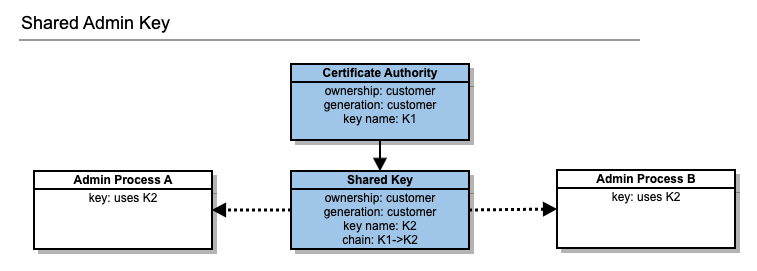
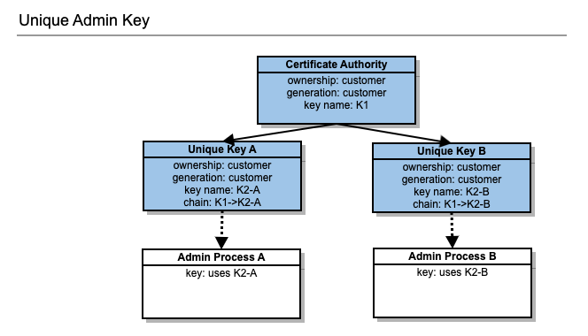
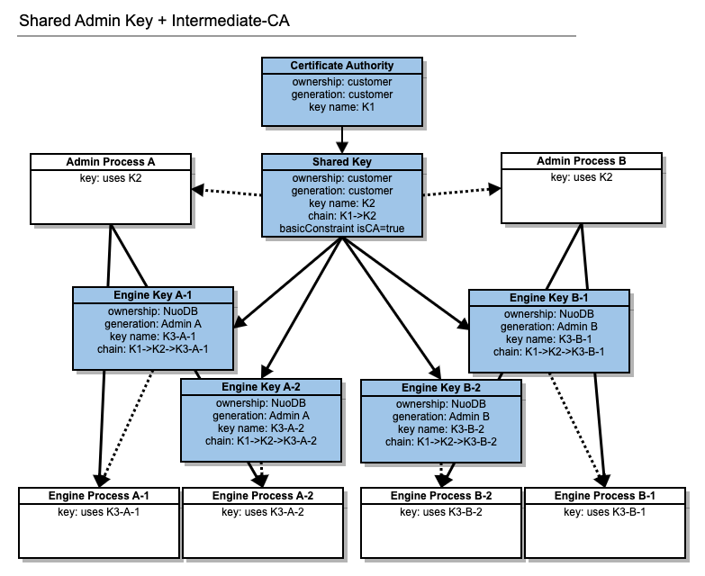
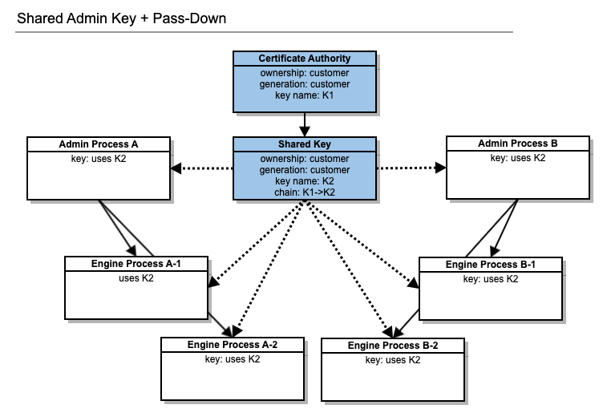

# Security Model of NuoDB in Kubernetes

## Introduction

NuoDB supports TLS encryption for all processes in the domain.
`NuoDB Admin` is responsible for propagating certificates to database processes, so to enable TLS encryption for all processes, it is necessary to configure NuoDB Admin with a set of certificates, and also configure NuoDB Command (`nuocmd`) clients to be able to communicate with `NuoDB Admin`.

> **NOTE**: For information on enabling  TLS encryption in non-Kubernetes deployments of NuoDB, see [here](http://doc.nuodb.com/Latest/Content/Nuoadmin-Configuring-TLS-Security.htm). 
This document expands on the product documentation and is specific to this Helm Chart repository.

### Terminology

- `Key` = a combination of a private key with its corresponding X509 certificate chain. 
These are usually saved in a PKCS12 file such as `nuoadmin.p12`.
- `NuoDB Admin` = admin interface for domain and database management. Started by the [Admin Chart](../stable/admin/README.md).
- `CA` = Certificate Authority

## Admin Trust Models
NuoDB recommends using one of the following two models in which certificates can be provisioned to enable TLS encryption.
- [Shared Admin Key](#shared-admin-key)
- [Unique Admin Key](#unique-admin-key)

For more info read [Configuring TLS Security](http://doc.nuodb.com/Latest/Content/Nuoadmin-Configuring-TLS-Security.htm).

### Shared Admin Key

The Shared Admin Key trust model is the default deployment model for NuoDB and it uses the same key pair certificate for all NuoDB Admin processes.
A disadvantage of this model is that every admin process is provisioned with the same key pair certificate, which means if that a certificate has to be replaced (for example, because it has expired), then every admin process must have its trusted certificates and key pair certificate replaced also.




In the graphic above you can see two keys. 
Key `K1` is the certificate authority and NuoDB will only require the public certificate. 
By convention, `K1` is stored in `ca.cert`. 
Key `K2` is the key that was generated for the NuoDB admin processes. 
NuoDB admin processes require both the certificate and the private key. 
By convention, `K2` is stored in `nuoadmin.p12`.

To use this model in Kubernetes, do the following:
1. Create keys
2. Create Secrets
3. Bind secrets

### Creating Keys
NuoDB does not recommend using the pre-generated TLS keys shipped with the NuoDB container. 
Starting with NuoDB 4.2, the NuoDB container no longer contains pre-generated keys. 
You can either create your own TLS keys or create them using the convenience script provided with the docker image:

```docker run --rm -d --name create-tls-keys nuodb/nuodb-ce:latest -- \ 
tail -f /dev/null

docker exec -it create-tls-keys bash -c "mkdir /tmp/keys && \ 
cd /tmp/keys && DEFAULT_PASSWORD=changeIt setup-keys.sh"

docker cp create-tls-keys:/tmp/keys ${KEYS_DIR}
docker stop create-tls-keys
```

### Creating secrets
You must provide the TLS keys to the admin stateful set.
NuoDB Kubernetes objects (StatefulSet, Deployment, DaemonSet,...) use Kubernetes Secrets to pass the TLS keys to the NuoDB processes.
NuoDB admin expects four separate secrets:
- `nuodb-keystore` containing the X509 that identifies the admin;
- `nuodb-truststore` usually containing the root CA and the primordial admin user;
- `nuodb-ca-cert` containing the public certificate of the Certificate Authority;
- `nuodb-client-pem` which is the private/public keypair for the primordial admin user.

Create those secrets as follows:


```# (aka ca.cert)
kubectl create secret generic nuodb-ca-cert \
  --from-file=ca.cert=${KEYS_DIR}/ca.cert

# The PEM file containing the certificate used to verify admin certificates (aka nuocmd.pem)
kubectl create secret generic nuodb-client-pem \
  --from-file=nuocmd.pem=${KEYS_DIR}/nuocmd.pem

# The keystore for the NuoDB Admin process; contains only the admin 
# key and certificate (aka nuoadmin.p12).
kubectl create secret generic nuodb-keystore \
--from-file=nuoadmin.p12=${KEYS_DIR}/nuoadmin.p12 \
--from-literal=password=${PASSWORD}

# Contains the certificate used to verify admin certificates 
# and the client certificate (aka nuoadmin-truststore.p12).
kubectl create secret generic nuodb-truststore \
--from-file=nuoadmin-truststore.p12=${KEYS_DIR}/nuoadmin-truststore.p12 \
--from-literal=password=${PASSWORD}
```

> **NOTE**: The secrets need to be generated in the namespace where NuoDB will be running.

### Binding secrets

You will need these values set in the admin helm chart.
We provide the values as a GoLang object, not as a sample YAML file.
You will have to replace the `PASSWORD` placeholder.

```
helm.Options{
	SetValues: map[string]string{
		"admin.tlsCACert.secret":       "nuodb-ca-cert",
		"admin.tlsCACert.key":          "ca.cert",
		"admin.tlsKeyStore.secret":     "nuodb-keystore",
		"admin.tlsKeyStore.key":        "nuoadmin.p12",
		"admin.tlsKeyStore.password":   <${PASSWORD}>,
		"admin.tlsTrustStore.secret":   "nuodb-truststore",
		"admin.tlsTrustStore.key":      "nuoadmin-truststore.p12",
		"admin.tlsTrustStore.password": <${PASSWORD}>,
		"admin.tlsClientPEM.secret":    "nuodb-client-pem",
		"admin.tlsClientPEM.key":       "nuocmd.pem",
	},
}
```

### Unique Admin Key

We mention this model for completeness.
It can be used in bare metal deployments of NuoDB, but complex automation is required to use this model in deployments of NuoDB managed by Kubernetes.
As such, we will not explore this model further.
This model provisions a unique key pair certificate for each admin process, each signed by a Certificate Authority (CA) trusted by all entities (admin processes and client).



## Engine Key Models

NuoDB supports various key models for TLS keys used by the engine processes (Storage Managers, Transaction Engines).
Although you can mix and match key models with the trust model that best suits your application, NuoDB recommends using the Shared Admin Key model with the following key models:
- [Intermediate CA](#intermediate-ca)
- [Pass-down](#pass-down)

### Intermediate CA

NuoDB is shipped with predefined TLS keys that follow this model. 

In this key model, NuoDB Admin acts as an intermediate Certificate Authority (CA) that signs engine certificates on demand.
As you scale your deployment, each database process will request a new certificate from NuoDB Admin at startup.
Each process has its own certificate that is not shared with any other process.
The certificate will contain the DNS entry of the process and can be used for DN matching.

To use this model, the shared key used by NuoDB Admin must have `basicConstraints:isCA` set to `true`.
This allows NuoDB Admin to act as a CA.
This is usually not the case with public third-party certificate authorities.



As you can see in the graphic above, NuoDB automatically generates engine keys (`K3-*`) for engines `A-1`, `A-2`, `B-1`, and `B-2`.
These keys have been signed by the admin process (key `K2`), which in turn, has been signed by the CA (key `K1`).
The knowledge of the CA public certificate `ca.cert` is sufficient to verify the chain.

#### Helm Chart Values

To use the Intermediate CA model, NuoDB Admin must be configured as described in [Shared Key](#shared-admin-key). 
These values need to be set in the [Database chart](../stable/Database/README.md): (provided as a GoLang object)

```
helm.Options{
SetValues: map[string]string{
		"admin.tlsCACert.secret":       "nuodb-ca-cert",
		"admin.tlsCACert.key":          "ca.cert",
		"admin.tlsKeyStore.secret":     "nuodb-keystore",
		"admin.tlsKeyStore.key":        "nuoadmin.p12",
		"admin.tlsKeyStore.password":   <${PASSWORD}>,
		"admin.tlsTrustStore.secret":   "nuodb-truststore",
		"admin.tlsTrustStore.key":      "nuoadmin-truststore.p12",
		"admin.tlsTrustStore.password": <${PASSWORD}>,
	},
}
```

> **NOTE**: The `admin` values are the same as the options provided to the `admin chart`. 

### Pass-down

This is the simplest model and it works with well known third party Certificate Authorities such as `DigiCert`, `Let’s Encrypt` and others. 



As illustrated in the graphic above, the same key `K2` is used by all admin and database processes.

#### Helm Chart Values

To use the Pass-Down model, NuoDB must be configured as described in [Shared Key](#shared-admin-key).
These values need to be set in the [Database chart](../stable/Database/README.md): (provided as a GoLang object)

```
helm.Options{
SetValues: map[string]string{
		"admin.tlsCACert.secret":       "nuodb-ca-cert",
		"admin.tlsCACert.key":          "ca.cert",
		"admin.tlsKeyStore.secret":     "nuodb-keystore",
		"admin.tlsKeyStore.key":        "nuoadmin.p12",
		"admin.tlsKeyStore.password":   <${PASSWORD}>,
		"admin.tlsTrustStore.secret":   "nuodb-truststore",
		"admin.tlsTrustStore.key":      "nuoadmin-truststore.p12",
		"admin.tlsTrustStore.password": <${PASSWORD}>,
		"database.te.otherOptions.keystore": "/etc/nuodb/keys/nuoadmin.p12",
		"database.sm.otherOptions.keystore": "/etc/nuodb/keys/nuoadmin.p12",
	},
}
```
    
> **NOTE**: The `admin` values are the same as the options provided to the `admin chart`.
The values `database.te.otherOptions.keystore` and `database.sm.otherOptions.keystore` tell the engines to not use the [Intermediate Model](#intermediate-ca) and use the local key `K2` provided instead.

## Domain Name Verification

This section talks about `NuoDB SQL clients` and their secure configuration.
This section does not apply to the NuoDB processes running in your Kubernetes deployment.

There are many security models that work in Kubernetes.
We will explore some of them.

### Wildcard Certificates

One of the easiest solutions (but provides reduced security) is to provide the domain with a single wildcard certificate.
If wildcards are acceptable, use the [Shared Key]((#shared-admin-key)) Key Model with [Pass-Down](#pass-down).

### Well Known Third Party

If you want to use a well known third party certificate such as `DigiCert` or `Let’s Encrypt`, the [Intermediate CA](#intermediate-ca) model can not be used.
Since all NuoDB admin processes will be running on a different host, NuoDB recommends setting the DN to the Kubernetes `Load Balancer` Service.
To verify the identity of the database process (NuoDB Transaction Engine) you will have to have the hostname of the TE in the certificate.
This can be achieved by requesting multiple host-names upfront or by turning `DN verification` off.

### Private CA

Using a Private CA is the recommended option.
Generate a [Shared Key]((#shared-admin-key)) that has `basicConstraints:isCA` set to `true`.
Use the Intermediate CA model to automatically sign all database processes as your deployment scales and adapts to load.