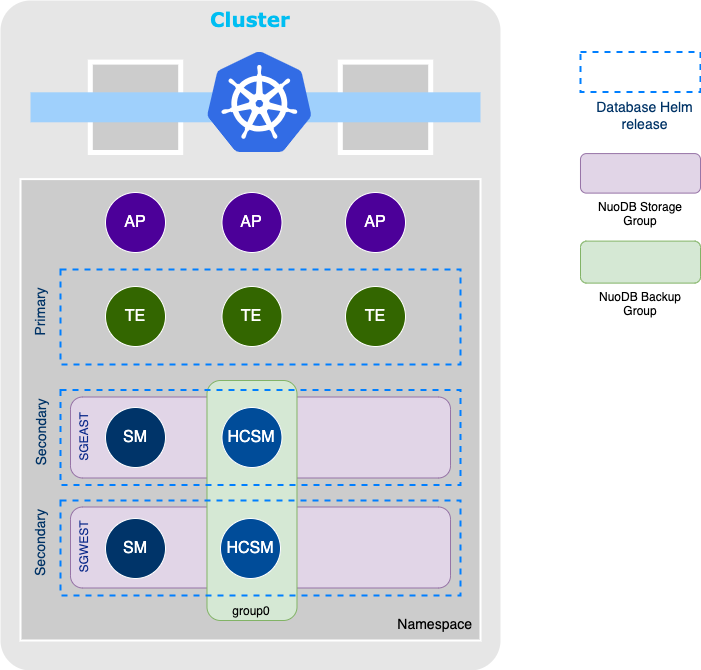

# Table Partitions and Storage Groups

<details>
<summary>Table of Contents</summary>
<!-- TOC -->

- [Table Partitions and Storage Groups](#table-partitions-and-storage-groups)
    - [Introduction](#introduction)
    - [Deployment Overview](#deployment-overview)
        - [Prerequisites](#prerequisites)
        - [Example](#example)
    - [Managing Storage Groups](#managing-storage-groups)
        - [Adding Storage Group](#adding-storage-group)
        - [Removing Storage Group](#removing-storage-group)
        - [Storage Group Maintenance](#storage-group-maintenance)
        - [Start Unavailable Storage Group](#start-unavailable-storage-group)
        - [Storage Group Name Reconfiguration](#storage-group-name-reconfiguration)
    - [Backup Database with TPSG](#backup-database-with-tpsg)
        - [Domain Process Labels](#domain-process-labels)
    - [Restore Database with TPSG](#restore-database-with-tpsg)
        - [Automatic archive initial import](#automatic-archive-initial-import)
    - [Troubleshooting](#troubleshooting)
        - [Storage Group Assignment Mismatch](#storage-group-assignment-mismatch)
        - [Backup Failure](#backup-failure)
        - [Storage Group Startup Failure](#storage-group-startup-failure)

<!-- /TOC -->
</details>

## Introduction

Table partitioning is the mechanism by which a version of a database table row is stored on a subset of Storage Managers (SMs) running in a NuoDB database.
A table partition is an attribute that can be associated with a database table.
A storage group represents a logical storage unit that can be serviced by multiple SMs in a database.
Each partition within a table has a uniquely identified name that maps to one storage group (SG) which represents a logical storage unit that can be serviced by multiple SMs in a database.

This document explains how to configure Table Partitions and Storage Groups (TPSG) in NuoDB Kubernetes deployments.

>**Note**
> For non-Kubernetes deployments, see  [Table Partitions and Storage Groups][2]. This page expands on the product documentation and is specific to this Helm Chart repository.

## Deployment Overview

NuoDB [database](../stable/database) Helm chart can be installed multiple times in a single Kubernetes namespace where there is one _primary_ and any number of _secondary_ Helm release.
A storage group is deployed as a separate _secondary_ Helm release which also deploys the SMs servicing this storage group.
This allows the user to remove any storage group without removing resources installed by the _primary_ database Helm release.
To simplify TPSG operations and observability, NuoDB Helm charts support one storage group per Storage Manager StatefulSet.

For information on adding storage groups, see [Managing Storage Groups](#managing-storage-groups).

### Prerequisites

- NuoDB 5.0.4 or later
- NuoDB Helm charts 3.6.0 or later

### Example

The below diagram shows an example of a TPSG deployment in a single Kubernetes cluster with two storage groups.



Before continuing, make sure that you have a running NuoDB Administration layer in the target namespace.
For more information, see [NuoDB Admin Helm Chart](../stable/admin/).

In this example, a NuoDB database with two storage groups is provisioned into the Kubernetes namespace.
The Transaction Engines (TEs) are part of the _primary_ Helm release which is deployed first.
One backup group is configured that includes all Hot-copy Storage Managers (HCSMs) as there will be one deployed per storage group.
For more information on configuring backup when TPSG is enabled, see [Backup Database with TPSG](#backup-database-with-tpsg).

```sh
helm upgrade --install database stable/database \
  --set database.te.replicas=3 \
  --set database.sm.hotCopy.replicas=0 \
  --set database.sm.noHotCopy.replicas=0 \
  --set database.sm.hotCopy.backupGroups.group0.labels="role hotcopy" \
  -f values.yaml
```

Database storage groups are deployed by installing the _database_ Helm chart several times as _secondary_ Helm release.
By default, the Helm release name is used as the storage group name unless customized by supplying `database.sm.storageGroup.name` value.

```sh
helm upgrade --install sgeast stable/database \
    --set database.sm.storageGroup.enabled=true \
    --set database.primaryRelease=false \
    --set database.sm.hotCopy.replicas=1 \
    --set database.sm.noHotCopy.replicas=1 \
    --set database.te.enablePod=false \
    -f values.yaml
```

```sh
helm upgrade --install sgwest stable/database \
  --set database.sm.storageGroup.enabled=true \
  --set database.primaryRelease=false \
  --set database.sm.hotCopy.replicas=1 \
  --set database.sm.noHotCopy.replicas=1 \
  --set database.te.enablePod=false \
  -f values.yaml
```

>**Note**
> A best practice is that each storage group is serviced by at least two SMs. This improves the SG availability in cases where one of the SMs goes down or is stopped for maintenance.

Verify storage group assignment after all database pods are reported ready.

```sh
kubectl exec admin-nuodb-cluster0-0 -- \
    nuocmd get storage-groups --db-name demo
```

There should be four storage groups `SGEAST`, `SGWEST`, and two [predefined SGs][3].

```text
StorageGroup(archive_states={}, db_name=demo, id=1, leader_candidates=[], name=ALL, process_states={}, state=Available)
StorageGroup(archive_states={0: ADDED, 1: ADDED}, db_name=demo, id=10, leader_candidates=[0, 19], name=SGEAST, process_states={0: RUNNING, 19: RUNNING}, state=Available)
StorageGroup(archive_states={2: ADDED, 3: ADDED}, db_name=demo, id=11, leader_candidates=[16, 18], name=SGWEST, process_states={16: RUNNING, 18: RUNNING}, state=Available)
StorageGroup(archive_states={}, db_name=demo, id=2, leader_candidates=[0, 16, 18, 19], name=UNPARTITIONED, process_states={0: RUNNING, 16: RUNNING, 18: RUNNING, 19: RUNNING}, state=Available)
```

Create a table with two partitions stored in configured storage groups.

```sql
CREATE TABLE users (first STRING, last STRING, zip CHAR(5) ) PARTITION BY RANGE (zip) (
    PARTITION p_east VALUES LESS THAN ('70000') STORE IN sgeast 
    PARTITION p_west VALUES LESS THAN (MAXVALUE) STORE IN sgwest);

INSERT INTO users VALUES ('Joe','Friendly', '02180');
INSERT INTO users VALUES ('Nancy','Nike', '97008');
```

Verify the row counts in each storage group.

```sql
SELECT 
    pids.PARTITIONNAME, 
    pids.STORAGEGROUP, 
    count(0) as COUNT 
FROM 
    users c 
        INNER JOIN system.PARTITIONIDS pids 
        ON c._record_partitionid = pids.PARTITIONID 
GROUP BY pids.PARTITIONNAME, pids.STORAGEGROUP;
```

```text
 PARTITIONNAME  STORAGEGROUP  COUNT
 -------------- ------------- ------

     P_EAST        SGEAST       1
     P_WEST        SGWEST       1
```

## Managing Storage Groups

### Adding Storage Group

A new storage is added to an existing database by installing another _secondary_ Helm release.
This will create the storage group and associate it with the archive IDs of the SMs deployed by this release.
After the new storage group transitions to _Available_ state, it can be used to store table partitions.
For more information, see [Example Deployment](#example) and [ALTER TABLE][6].

### Removing Storage Group

A storage group goes permanently offline for the following reasons:

- The storage group is removed from all database archives with no intent of adding it back to any archive.
- All archives serving the storage group are damaged or lost.

A storage group that has gone permanently offline must be deleted.
Deleting a storage group informs the database that it no longer needs to wait for the storage group to come back online.

>**Note**
> A storage group can only be deleted from the database if it was previously removed from all archives or if the archives serving the storage group are deleted.

Remove the Helm release corresponding to this storage group.

```sh
helm delete sgeast
```

Delete all _archive_ Persistent Volume Claims (PVCs) for this storage group.

```sh
for pvc in $(kubectl get pvc -l domain=nuodb,database=demo,release=sgeast -oname | grep '/archive-volume-'); do
    kubectl delete $pvc
done
```

If [Kubernetes Aware Admin][1] (KAA) is configured, it will automatically delete all archive objects from the domain state that corresponds to the deleted PVCs.

Delete a permanently offline storage group from the database.

>**Warning**
> Deleting a storage group will remove all table partitions and data stored in the storage group.

```sh
kubectl exec admin-nuodb-cluster0-0 -- \
    nuocmd delete storage-group --db-name demo --sg-name sgeast
```

### Storage Group Maintenance

A storage group goes temporarily offline for the following reasons:

- There is no `RUNNING` SM servicing this storage group.
- None of the SMs servicing the storage group can become `RUNNING` and maintenance operations must be performed such as `nuoarchive check`.

A storage group that is temporarily offline must be brought into maintenance.
This will inform TEs and scheduled backups that they no longer need to wait for the storage group to come online.

>**Important**
> Bringing a storage group into maintenance will exclude it from database backups. Restoring from such a backup could cause data loss or inconsistent data and must be used with caution.

To put a storage group into maintenance, scale down all corresponding SMs and remove all the archives that service it.

```sh
kubectl scale statefulset -l domain=nuodb,database=demo,release=sgeast --replicas 0
```

Get the archive IDs that are associated with the storage group.
The `archive_states` property has all archive IDs associated to this storage group.

```sh
kubectl exec admin-nuodb-cluster0-0 -- \
    nuocmd get storage-groups --db-name demo
```

If [Kubernetes Aware Admin][1] is configured, there will be only one archive associated with the storage group as KAA will automatically remove archives for scaled-down SMs.

```text
...
StorageGroup(archive_states={0: ADDED}, db_name=demo, id=10, leader_candidates=[], name=SGEAST, process_states={}, state=Unavailable)
...
```

Delete, _but not_ purge, the last archive that services this storage group.

```sh
kubectl exec admin-nuodb-cluster0-0 -- \
    nuocmd delete archive --archive-id 0
```

### Start Unavailable Storage Group

Starting a previously _unavailable_ storage group in a database with running TEs is not supported.
All TEs must be scaled down before the previously _unavailable_ storage group can be started.

>**Warning**
> Scaling down all TEs in the database will make the database unavailable to applications so make sure to schedule this operation.

```sh
kubectl scale deployment -l domain=nuodb,database=demo,component=te --replicas 0
```

Start the existing storage group which was previously unavailable.

```sh
kubectl scale statefulset -l domain=nuodb,database=demo,release=sgeast --replicas 0
```

Start the TEs which will wait for the storage group to become available.

```sh
kubectl scale deployment -l domain=nuodb,database=demo,component=te --replicas 3
```

### Storage Group Name Reconfiguration

Updating storage group name via Helm values is not supported.
Instead, a new storage group should be added and the old one removed.
Warning messages are logged by SMs if the current SG name value doesn't match the SG serviced by the archive.

For more information, see [Adding Storage Group](#adding-storage-group) and [Removing Storage Group](#removing-storage-group).

## Backup Database with TPSG

Backup and restore in NuoDB Helm charts is done via online (hot-copy) product facilities and supports coordinated hot-copy of multiple archives.
For more information on backup and restore, check [NuoDB Backup and Restore in Kubernetes](./BackupAndRestore.md) and [Using Hot Copy Successfully][4].

When executing a hot-copy request against a database configured with storage groups, it is required to select archives that include all database storage groups.
NuoDB will verify that the selected archives/SMs include all storage groups configured for the database to prevent the user from creating an incomplete backup.

Backup group selection is configured in the _primary_ Helm release using one of the following ways:

- NuoDB process labels by specifying `database.sm.hotCopy.backupGroups.<group name>.labels` Helm value.
- NuoDB process filter which follows [LQuery][5] syntax by specifying `database.sm.hotCopy.backupGroups.<group name>.processFilter` Helm value.

In the [example](#example) above, there is one HCSM deployed by storage group and each of them has `role` domain process label with the value of `hotcopy`.
Selecting all HCSMs using labels `role hotcopy` includes all storage groups in the databases.

### Domain Process Labels

NuoDB injects additional domain process labels that can help backup group selection.
The table below shows all injected process labels.

| Label Key | Description | Scope | Example Value |
| ----- | ----- | ----------- | ------ |
| backup | The configured backup group prefix `database.sm.hotCopy.backupGroupPrefix` (the cluster name by default). | HCSM | cluster0 |
| sg | The storage group name serviced by the SM when TPSG is enabled. | SM | sgeast |
| role | The SM _role_. | HCSM | hotcopy |
| archive-pvc | The PVC name of the archive volume. (requires KAA) | SM | archive-volume-sm-database-nuodb-cluster0-demo-hotcopy-0 |
| pod-name | The Kubernetes POD name. (requires KAA) | TE, SM | sm-database-nuodb-cluster0-demo-hotcopy-0 |
| pod-uid | The Kubernetes POD UID. (requires KAA) | TE, SM | fe8530ea-bedd-43ce-a8ec-b218869bf2dd |

## Restore Database with TPSG

Restoring a database with TPSG requires that all storage groups are restored.
At least one database archive per storage group must be selected for restore.
If one of the special tags (`:latest`, `:group-latest`, or `<group-name>:<tag>`) is used as a restore source, all SMs that participated in the backup will be restored automatically.
For more information, see [Database Restore](./BackupAndRestore.md#restore).

### Automatic archive initial import

Initial import is enabled by specifying `database.autoImport` where a different _source_ must be configured for each storage group during installation of the corresponding _secondary_ database Helm release.
No additional synchronization between database processes is performed by NuoDB for this special case of a database restore operation.
To prevent a TE from starting while new storage groups are being created, the TEs replicas must be set initially to 0.

>**Note**
> The `database.autoImport.credentials` cannot be overridden by _secondary_ database Helm releases. If remote authentication is enabled, the credentials must be set when installing the _primary_ database Helm release.

Example steps to configure initial database archive import when TPSG is enabled are outlined below.

```sh
helm install database stable/database \
  --set database.te.replicas=0 \
  --set database.sm.hotCopy.replicas=0 \
  --set database.sm.noHotCopy.enablePod=false \
  ...
```

```sh
helm install sgeast stable/database \
    --set database.sm.storageGroup.enabled=true \
    --set database.primaryRelease=false \
    --set database.sm.hotCopy.replicas=1 \
    --set database.sm.noHotCopy.replicas=1 \
    --set database.te.enablePod=false \
    --set database.autoImport.type=backupset \
    --set database.autoImport.source=<URL to backup of SGEAST storage group> \
    -f values.yaml
```

```sh
helm install sgwest stable/database \
  --set database.sm.storageGroup.enabled=true \
  --set database.primaryRelease=false \
  --set database.sm.hotCopy.replicas=1 \
  --set database.sm.noHotCopy.replicas=1 \
  --set database.te.enablePod=false \
  --set database.autoImport.type=backupset \
  --set database.autoImport.source=<URL to backup of SGWEST storage group> \
  -f values.yaml
```

Wait for all database storage groups to become _Available_ and scale up the TEs.

```sh
kubectl scale deployment -l domain=nuodb,database=demo,component=te --replicas 3
```

## Troubleshooting

### Storage Group Assignment Mismatch

The SM startup logs below show a storage group assignment mismatch.
The archive is servicing storage group `SGEAST`, however, the SM has been reconfigured to service storage group `sgnyc`.

```text
2023-09-19T05:56:24.019+0000 INFO  [admin-nuodb-cluster0-0:sm-sgeast-nuodb-cluster0-demo-database-0] STDOUT Warning: Specified '--storage-groups' do not match storage groups for an existing archive
    The following storage groups are served by the archive but were not supplied via '--storage-groups':
        SGEAST
    Use the 'remove storage-group' command if you wish for the archive to stop serving them
    The following storage groups were supplied via '--storage-groups' but are not served by the archive
        sgnyc
    Use the 'add storage-group' command if you wish for the archive to start serving them
```

> **Action**: Storage group reconfiguration is unsupported. Revert the changes to the storage group name for this Helm release and install another Helm release for the new storage group. For more information, see [Storage Group Name Reconfiguration](#storage-group-name-reconfiguration).

### Backup Failure

The output below shows a failed _full_ backup:

```text
Executing full hotcopy as a prerequisite for incremental hotcopy: full hotcopy in backupset 20230919T053410 has failed
Starting full backup for database demo on processes with labels 'role hotcopy' ...
'backup database' failed: Failure while performing hot-copy: Not all storage groups are included in hot-copy for dbName=demo, missingSgs=[SGEAST]
Error running hotcopy 1
```

The error indicates that the database backup doesn't select any SM/archive that services _SGEAST_ storage group.
By looking into the process label selector, `role hotcopy` should match all HCSMs which is correct.
By inspecting the database state further, it has been observed that _SGEAST_ storage group is `Unavailable` with no _RUNNING_ SMs servicing it.

```text
...
StorageGroup(archive_states={1: ADDED}, db_name=demo, id=11, leader_candidates=[], name=SGEAST, process_states={}, state=Unavailable)
...
```

> **Action**: Start SMs that service _SGEAST_ storage group or bring it into maintenance. For more information, see [Start Unavailable Storage Group](#start-unavailable-storage-group) and [Storage Group Maintenance](#storage-group-maintenance).

### Storage Group Startup Failure

Storage Manager fails at startup with the below logs.

```text
2023-09-19T05:46:32.736+0000 [142] (demo sid 12 node 6) Error Context:
    MasterCatalog: OBJECT_COMPLETE
EXIT: SM serving storage group 'SGEAST' attempting to join a database containing TEs while the storage group is offline
```

> **Action**: Stop all TEs before starting a previously offline storage group. For more information, see [Start Unavailable Storage Group](#start-unavailable-storage-group).

[1]: https://nuodb.com/blog/introducing-kubernetes-aware-admin
[2]: https://doc.nuodb.com/nuodb/latest/database-administration/table-partitions-and-storage-groups/
[3]: https://doc.nuodb.com/nuodb/latest/database-administration/table-partitions-and-storage-groups/#_predefined_storage_groups
[4]: https://doc.nuodb.com/nuodb/latest/deployment-models/physical-or-vmware-environments-with-nuodb-admin/database-operations/backing-up-and-restoring-databases/using-online-backup/about-the-results-of-a-successful-hot-copy/
[5]: https://doc.nuodb.com/nuodb/latest/client-development/load-balancer-policies/#lbquery-expression-syntax
[6]: https://doc.nuodb.com/nuodb/latest/reference-information/sql-language/sql-statements/alter-table/
