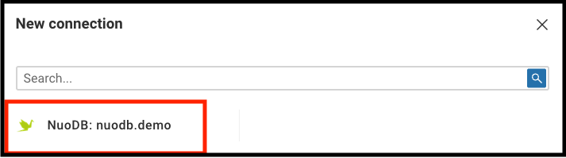
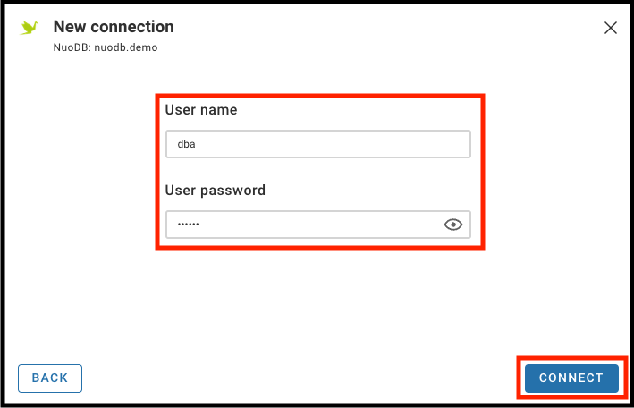

A helm chart to configure and install Cloudbeaver to work with NuoDB.

# Cloudbeaver for NuoDB

Cloudbeaver is a web based version of DBeaver, a popular universal GUI SQL tool compatible with NuoDB.  It is provided as a docker container, but has no helm chart.

See these websites for more detail:
 - https://cloudbeaver.io/
 - https://github.com/dbeaver/cloudbeaver
 - https://hub.docker.com/r/dbeaver/cloudbeaver
 - https://dbeaver.io/

# Installation

## Background
Cloudbeaver is not as dynamic as DBeaver.  With DBeaver, a supported database driver not already present would be downloaded automatically from Maven Central.  This functionality has been removed from Cloudbeaver.

A guide, provided by Cloudbeaver, explains how to add a custom driver, but requires rebuilding Cloudbeaver and the docker container to include the driver and configuration changes. See [https://cloudbeaver.io/docs/Adding-new-database-drivers/](https://cloudbeaver.io/docs/Adding-new-database-drivers/)

This helm chart, however, slides the NuoDB changes in without requiring a rebuild.  This avoids having to maintain a build of Cloudbeaver tied to the NuoDB driver version.  It should also reduce the need to update anything when the version of Cloudbeaver changes.   The main modifications are:

 - Mounting the /opt/Cloudbeaver/workspace directory as a persistent volume, so that configuration changes are retained after restarts.  Cloudbeaver is deployed as a statefulSet fixed to one replica, because it does not use a distributed database for its metadata.
 - Adding the NuoDB driver under `/opt/cloudbeaver/drivers/nuodb/`.  By default this is downloaded from maven by the 2nd init container called `nuodb-config`, to avoid having the binary in git.  You can choose the driver version by setting .`Values.cloudbeaver.nuodbDriverVersion`.  There is also an air gapped install option described later.
 - Replacing two `plugin.xml` files with versions that include additions for NuoDB, which are inside jars in `/opt/cloudbeaver/server/plugins`.  The details of the changes they contain are shown later, should they need to be recreated in the future.  This replacement is done in 3 parts:
	 - The 1st init container `source-jars` uses the Cloudbeaver image and copies the jars of interest to a shared volume location `/opt/cloudbeaver/cloudbeaver-jars`.    The script it runs is `source-jars.sh`.
	 - The 2nd init container `nuodb-config` replaces the `plugin.xml` in these jars.  The script it runs is `nuodb-config.sh`
	 - Lastly, when the `cloudbeaver` container starts, it first copies the modified jars back to `/opt/cloudbeaver/server/plugins` before running the original Cloudbeaver startup script.  The script it runs is `run-server-noudb.sh`

*NOTE: The scripts are not made dynamic based on whatever files might be provided during install.  The jars modified are specific, and we won't know what else might be needed to make this work in future versions of Cloudbeaver.  An alternative approach could be to provide the full or partial jars that need to be replaced or merged, but this implies more up front preparation and becomes difficult because of limitations to configMap sizes in Kubernetes.*

## Configurations
The `values.yaml` file has comments explaining what the different values do.

Under the `files` directory there are a number of configuration files.  They are described below:

**`files/cloudbeaver/cloudbeaver.conf`**

This contains some initial server configuration for Cloudbeaver.  Some of these entries are configured in the values file, under `cloudbeaver.configs.cloudbeaver`.  Default Changes include disabling the ability to save passwords for connections and allowing anonymous users to create connections.  These can also be changed adter deployment.  Note See this page for more information: https://github.com/dbeaver/cloudbeaver/wiki/Server-configuration

**`files/cloudbeaver/cloudbeaver.auto.conf`**

This contains some automatic initial server configuration for Cloudbeaver.  Some of these entries are configured in the values file, under `cloudbeaver.configs`.   The presence of this file causes  Cloudbeaver to skip the initial configuration on first login.  See this page for more information: https://github.com/dbeaver/cloudbeaver/wiki/Server-configuration#automatic-server-configuration

**`files/cloudbeaver/initial-data.conf`**

This contains initial configuration for the admin user and roles.  By default, anonymous access is possible, and users can be created by the admin user after first start.  The Cloudbeaver administrator user can also add users after deployment.  These entries are configured in the values file, under `cloudbeaver.configs.initialData`.  See this page for more information: https://github.com/dbeaver/cloudbeaver/wiki/Users

**`files/cloudbeaver/initial-data-sources.conf`**

This contains a default template datasource for each of the chosen NuoDB deployments, which is created using the values provided for the existing or expected NuoDB deployments.  Users will also be able to add their own additional data sources, for example if more databases are deployed after the initial deployment of Cloudbeaver.  These entries are configured in the values file, under `cloudbeaver.configs.initialDataSources`.  See this page for more information: https://github.com/dbeaver/cloudbeaver/wiki/Configuring-server-datasources

*NOTE: The above 3 configurations can be optionally disabled using `.Values.cloudbeaver.configs.override`.  Setting to false will use all Cloudbeaver default configuration files.*

**`files/io.cloudbeaver.resources.drivers.base/plugin.xml`**

This file has this 3 additional lines for NuoDB:

 - `<resource  name="drivers/nuodb"/>`
 - `<bundle  id="drivers.nuodb"  label="NuoDB drivers"/>`
 - `<driver  id="generic:nuodb"/>`

**`files/org.jkiss.dbeaver.ext.generic/plugin.xml`**

This file has 1 additional section for NuoDB:

    <driver
    id="nuodb"
    label="NuoDB"
    icon="icons/nuodb_icon.png"
    iconBig="icons/nuodb_icon_big.png"
    class="com.nuodb.jdbc.Driver"
    sampleURL="jdbc:com.nuodb://{host}[:{port}]/[{database}]"
    defaultPort="48004"
    description="NuoDB"
    webURL="http://www.nuodb.com/"
    categories="sql,cloud">
    <file  type="jar"  path="drivers/nuodb"/>
    </driver>

## Deployment
Install the chart with helm, for example:

    helm upgrade cloudbeaver ~/git/nuodb-helm-charts/incubator/cloudbeaver/ --namespace cloudbeaver --install --create-namespace

## First Start
After deployment, connect to the Cloudbeaver service in the appropriate way depending on the service type chosen in `.Values.cloudbeaver.service.type`.  By default this is ClusterIP, so we can port-forward and then open http://localhost:8978

    kubectl port-forward -n cloudbeaver service/cloudbeaver 8978:8978

On first start, if `.Values.cloudbeaver.override` was set  to `false`, Cloudbeaver will ask for an admin username and password to be configured.  If it was set to `true` it will take you directly to a query winodw with the anoymous user.  You can log in as the admin user with the username and password set in the values file.  Using an anonymous user will not save any connections created.

Create a new connection using the template, provide a username / password, and start to query... remember to set the query to use the connection.

*NOTE: The password is not stored as a kubernetes secret, because Cloudbeaver manages the password internally and any changes would not be reflected.*

Refer to the Cloudbeaver documentation linked above to understand more about how to operate Cloudbeaver.

## Air Gapped Environments
If the deployment environment will not have access to the internet, it is possible to instead pre-load the NuoDB driver jar as a config map.  It cannot be done by helm because it exceeds the maximum annotation size of 262144 bytes used by the *managedFields* feature of *apply*.

To do this, first `create` the driver (it is also possible to use `kubectl apply ... --server-side`):

    kubectl -n cloudbeaver create configmap kubectl create configmap nuodb-jdbc-jar --from-file=nuodb-jdbc-23.0.0.jar=nuodb-jdbc-23.0.0.jar

Set the correct `.Values.cloudbeaver.nuodbDriver.version` and `.Values.cloudbeaver.nuodbDriver.download` to `false`.  This will cause the statefulset to source the driver from the configmap instead of downloading it.

# Query Example
This image shows an example connection and query:

